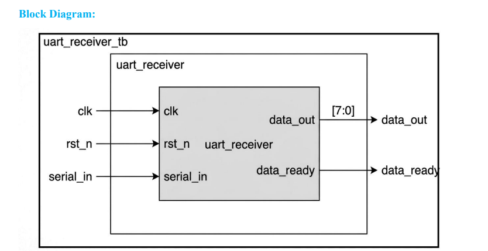
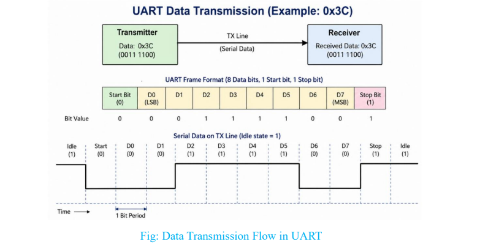
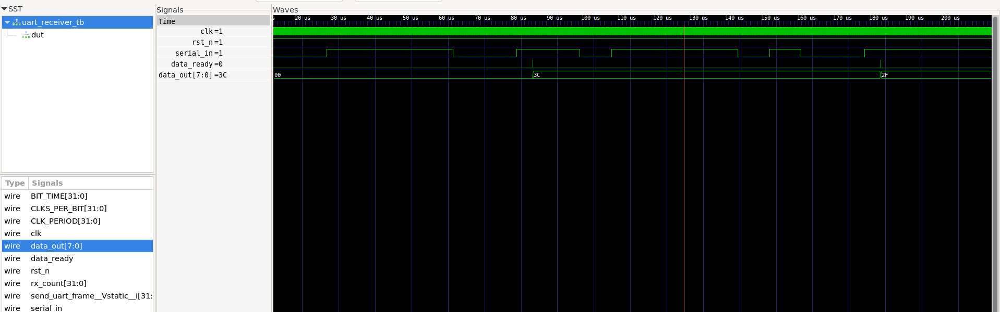

# UART-Receiver-Design

RTL implementation of a **UART Receiver** in Verilog — supports serial-to-parallel conversion, start/stop bit detection, metastability-safe input synchronization, and full functional verification with a self-checking testbench.

---

## 📌 Overview

This repository implements a synchronous **FSM-based UART Receiver** that captures asynchronous serial data on `serial_in`, samples it at the correct baud-aligned intervals, and reconstructs it into an 8-bit parallel output (`data_out`). The design follows the standard UART frame format: **1 Start Bit + 8 Data Bits + 1 Stop Bit**.

The receiver is designed for:
- **System Clock:** 25 MHz (40 ns period)
- **Baud Rate:** 115200 bps
- **Clocks per Bit:** 217 (`25,000,000 / 115,200`)
- **Bit Period:** 8.68 µs (`1 / 115,200`)

---

## 🧩 Block Diagram

<p align="center">
  
</p>

| Port | Direction | Width | Description |
|---|---|---|---|
| `clk` | Input | 1 | System clock (25 MHz) |
| `rst_n` | Input | 1 | Active-low asynchronous reset |
| `serial_in` | Input | 1 | Serial data input line |
| `data_out` | Output | 8 | Received parallel byte |
| `data_ready` | Output | 1 | Asserted for 1 clock cycle when a byte is fully received |

---

## 📡 UART Frame Format

<p align="center">
  
</p>

Example: transmitting `0x3C` → `0011 1100`

| Start (0) | D0(LSB) | D1 | D2 | D3 | D4 | D5 | D6 | D7(MSB) | Stop (1) |
|---|---|---|---|---|---|---|---|---|---|
| 0 | 0 | 0 | 1 | 1 | 1 | 1 | 0 | 0 | 1 |

The line idles **HIGH**; a **falling edge** marks the start of a new frame.

---

## ⚙️ Design Architecture

The receiver is a **4-state FSM**: `IDLE → START → RECV → STOP → IDLE`.

To avoid metastability from the asynchronous serial input, `serial_in` is passed through a **2-stage synchronizer** (`rx_meta`, `rx_sync`) before being used by the FSM.

### Internal Registers

| Signal | Purpose |
|---|---|
| `state` | Current FSM state |
| `clk_count` | Counts clock cycles within each bit period |
| `bit_index` | Tracks which of the 8 data bits is currently being sampled |
| `data_buf` | Shift register that assembles the received byte |

### State Transition Table

| State | Description | Next State Condition |
|---|---|---|
| **IDLE** | Waits for the line to go low (start bit) | `serial_in == 0` → go to `START` |
| **START** | Waits half a bit period, validates start bit | Line still low → `RECV`; else → `IDLE` (glitch rejected) |
| **RECV** | Samples 8 data bits at each baud interval into `data_buf` | After 8 bits → `STOP` |
| **STOP** | Waits one bit period, checks stop bit | Loads `data_out`, pulses `data_ready`, returns to `IDLE` |

---

## 🗂️ Repository Structure

```
UART-Receiver-Design/
├── docs/
│   ├── uart_frame.png              # UART frame format diagram
│   └── uart_receiver.png           # Block diagram
├── rtl/
│   └── uart_receiver.v             # UART Receiver RTL (synthesizable)
├── tb/
│   └── uart_receiver_tb.v          # Self-checking testbench
├── simulation/
│   └── uart_receiver_waveform.png  # GTKWave waveform capture
└── README.md
```

---

## 🛠️ Tools Used

| Tool | Purpose |
|---|---|
| **Verilog (RTL + TB)** | Design and verification language |
| **Verilator** | Fast open-source RTL simulator / lint |
| **GTKWave** | Waveform viewing and debug |
| **Xilinx Vivado** | Synthesis / FPGA-target validation |

---

## ▶️ Running the Simulation

### 1. Prerequisites
Make sure `verilator` and `gtkwave` are installed on your system.

```bash
sudo apt install verilator gtkwave
```

### 2. Simulation Script — `run.sh`

```bash
#!/bin/bash

# Step 1: Compile RTL and Testbench using Verilator
verilator --binary -j 0 -Wall uart_receiver.v uart_receiver_tb.v \
  --top uart_receiver_tb --timing --trace -- CFLAGS "-std=c++20"

# Step 2: Move into build directory
cd obj_dir || { echo "Error: obj_dir not found"; exit 1; }

# Step 3: Build simulation executable
make -f Vuart_receiver_tb.mk Vuart_receiver_tb || { echo "Error: Compilation failed"; exit 1; }

# Step 4: Run simulation
./Vuart_receiver_tb || { echo "Error: Simulation failed"; exit 1; }

# Step 5: Open waveform in GTKWave
gtkwave uart_receiver_tb.vcd
```

### 3. Make it executable and run

```bash
chmod +x run.sh
./run.sh
```

---

## ✅ Simulation Results

The testbench transmits two bytes — `0x3C` (`0011_1100`) and `0x2F` (`0010_1111`) — through `serial_in` using the standard UART frame format.

```
RX[1] @ 83220000 ns  = 3c
RX[2] @ 178700000 ns = 2f
Final data_out       = 2f

PASS: Two bytes received successfully
```

For each frame, the receiver correctly:
- Detects the start bit
- Samples all 8 data bits at the required baud-aligned intervals
- Validates the stop bit
- Asserts `data_ready` for exactly one clock cycle
- Updates `data_out` with the correctly reconstructed byte

This confirms correct handling of **back-to-back consecutive byte transfers**.

<p align="center">
  
</p>

---

## 🚀 Applications

UART receivers are core building blocks in:
- Embedded systems & microcontroller communication
- Sensor interfacing
- Debug / bootloader interfaces
- Wireless module communication (BLE/Wi-Fi UART bridges)
- Any system requiring reliable low-pin-count serial data reception

---

## 📄 License

This project is open for academic and personal learning use. Feel free to fork and extend it (e.g., add a UART Transmitter, configurable baud rate, or parity support).
